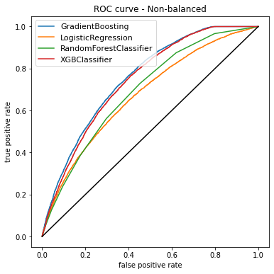
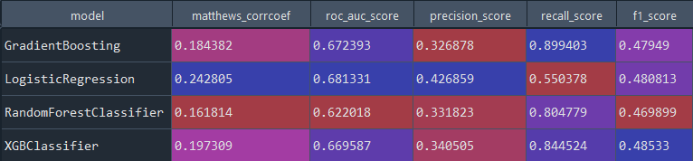

# Loan Eligibility Prediction using Gradient Boosting Classifier

## About the Project

The repository contains the code and the data to reproduce the results a loan eligilibity prediction using Gradient Boosting Classifier. In this project, I explored and clensed a dataset consisting of over 100,000 loan records to determine the best way to predict whether a loan aplicant should be granted a loan or not. I built a machine learning model that returns the unique customer ID and a loan status label that indicates whether the loan should be given to that individual or not.

## Dataset

The dataset used is an anonymized synthetic data that was generated specifically for use in this project. The data is designed to exhibit similar characteristics to genuine loan data.

## Data Description

The data description for the csv file is shown below:

| Column                    | Description                                                                        |
| ------------------------- | -----------------------------------------------------------------------------------|
| `Loan ID`           | A unique identifier for the loan information           |
| `Customer ID`                  | A unique identifier for the customer. Customers may have more than one loan                      |
| `Loan Status`                      | A categorical variable indicating if the loan was given to the customer              |
| `Current Loan Amount`                     | This is the loan amount that was either completely paid off, or the amount that was defaulted. This data is for previous loan  |
| `Term`                     | A categorical variable indicating if it is a short term or long term loan         |
| `Credit Score`           | A value between 0 and 800 indicating the riskiness of borrower's credit history     |
| `Years in current job`                      | A categorical variable indicating how many years the customer has been in their current job |
| `Home Ownership`                     | Categorical variable indicating home ownership. Values are "Rent", "Home Mortgage", and "Own". If the value is OWN, then the customer is a home owner with no mortgage |
| `Annual Income`                     | The customer's annual income   |
| `Purpose`                     | A description of the purpose of the loan  |
| `Monthly Debt`                     | The customer's monthly payment of their existing loans  |
| `Years of Credit History`                     | The years since the first entry in the customer's credit history  |
| `Months since last delinquent`                     | Months since the last loan delinquent payment  |
| `Number of Open Accounts`                     | The total number of open credit cards  |
| `Number of Credit Problems`                     | The number of credit problems in the customer records  |
| `Current Credit Balance`                     | The current total debt for the customer  |
| `Maximum Open Credit`                     | The maximum credit limit for all credit sources  |
| `Bankruptcies`                     | The maximum credit limit for all credit sources  |
| `Tax Liens`                     | The number of tax liens  |

## Methodology & Results

Every classification model tries to predict the probability of the class, which will give an output of one. In the case of this project, the data has 63737 of the rows has "loan given" as the status, whereas only 25173 has the status "loan refused ." After binarization of this dataset, one is assigned to "loan refused" and "loan given" is 0. As a result, the recall value is essentially the loan being refused, and our precision value is the overall accuracy. Meaning the sensitivity (this measures the proportion of true positives that are correctly identified out of all possible positives) is the loan refusal rate, and the specificity ( this measures the proportion of true negatives that are correctly identified out of all possible negatives) is the loan approval rate. Since we want to determine the loan approval rate, I will focus on specificity instead of sensitivity. In this problem, my goal is to see which model has the highest specificity and a good ROC score.  

## Running the Models

### Non-balance dataset



From the TPR vs. FPR graph, the blue line, GradientBoosting, has the highest area under the curve. That is measured by the line, which is farther out than all the other algorithms.

### Models Output


According to the models' table above, GradientBoosting gives the highest Matthews_corrcoef of approximately 0.25, which is decent. The highest ROC AUC score is also given by the GradientBoosting model. The recall is highest for XGBClassifier, but our variable of interest is the precision score which the GradientBoosting model records at approximately 0.58. XGBClassifier and GradientBoosting are identical, but because the ROC curve of GradientBoosting is higher, we can conclude that GradientBoosting is performing much better than the other classifiers. Of course, given a choice, you can always go ahead with XGBClassifier because both are performing well.

### Confusion matrix for models

### Balance the dataset – Smote Pickle

This part aimed to balance class distribution by randomly increasing minority class examples by replicating them. In the dataset, the minority class is “loan refused” because it has only 25173 records. The SMOTE synthesis the new minority instances between the existing minority instances. This means that SMOTE will try to create new observations based on the existing ones by doing some linear interpolation for the minority class. The interpolation is done by using the KNearestNeighbor methodology. For the reconstruction, the data was balanced as 50-50. Running the models with the balanced dataset gave the output below.



The output above shows that, Logistic Regression performed better than the other models under this dataset. Although the f1_score has increased from this output, the ROC Curve has decreased for three models. This means that the balancing of the dataset did not work out well for our ROC Score. Similarly, Logistic Regression gives the best Matthews correlation coefficient and the worst recall score. Something is wrong with the other three models; the balancing did not work out correctly. So I will not go ahead with the balanced dataset for the model. Sticking to the non-balanced dataset is ideal for this problem.
I dumped the model in a pickle file which is saved in the output folder of this project.

## Testing the Model

Run the test.py file by calling the pickle file and loading a test data to the model for prediction to be made.

## Directory Structure

The directory structure for the repository has been shown below in the form of a tree.

```text
.
├── data
│   ├── loan_data.csv
│   └── test_data.csv  
│ 
├── plots
│   ├── balanced_data_models_output.png
│   ├── loan_status_distribution.png
│   ├── models_output.png
│   ├── roc_curve_balanced.png
│   └── roc_curve_non_balanced.png
│ 
├── src
│   ├── main.py
│   └── test.py
│ 
├── model
│   └── GBM_Model_version1.pkl
│
├── test_output
│   └── Output_Test.csv
│ 
├── README.md
└── LICENSE

```

## License

This code is available under the [MIT License](LICENSE)

Wikimedia [Terms of Use](https://foundation.wikimedia.org/wiki/Terms_of_Use/en)
